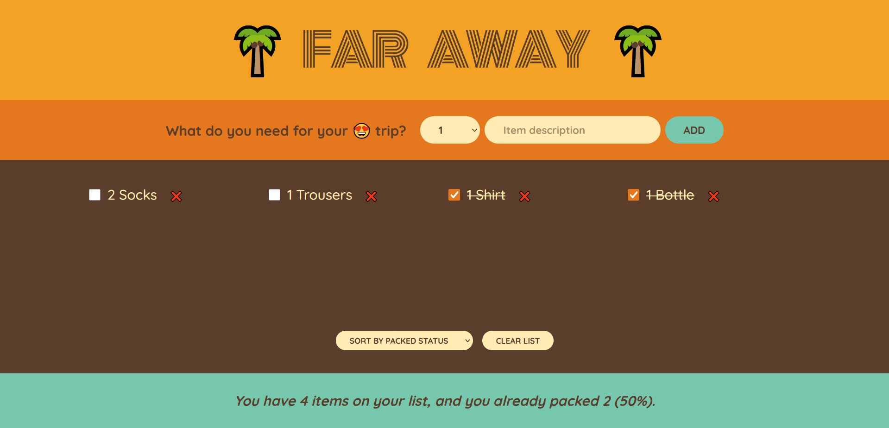

# Travel-list

A simple React application for managing and organizing travel plans.

> **Note:**  
> This project is based on UI and exercises from an **Udemy React course**.  
> The UI design and component structure follow the course material, with custom improvements added on top.

## Overview

**Travel-list** is a lightweight web application built with React that helps users create and manage lists related to their travels. It allows you to add travel items, mark them as completed, and organize your trip efficiently.

## Features

- Create new travel items (places to visit, tasks, notes, etc.)
- Mark items as completed
- Filter items (completed / not completed)
- Local state management (no backend required)

## Technologies Used

- **React** (Create React App)
- **JavaScript (ES6+)**
- **HTML & CSS**
- **npm** for dependency management

## Installation & Setup

### 1 Clone the repository

```bash
git clone https://github.com/kostelnikp/Travel-list.git
cd Travel-list
```

### 2 Install dependencies

```bash
npm install
```

### 3 Start the development server

```bash
npm start
```

## Screenshots

### Main page


